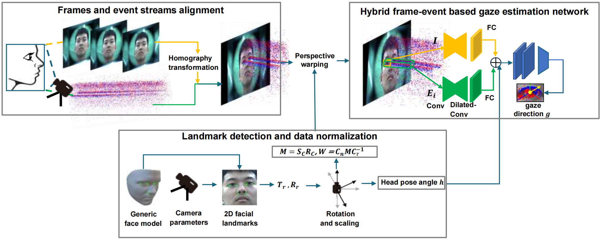
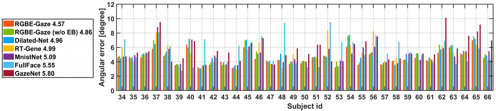

# RGBE-Gaze:A Large-scale Event-based Multimodal Dataset for High Frequency Remote Gaze Tracking
## Citation
 If you are using this dataset in your paper, please cite the following paper :
```
@inproceedings{  
  title = {RGBE-Gaze: A Large-scale Event-based Multimodal Dataset for High Frequency Remote Gaze Tracking},  
  author = {Guangrong Zhao, Yiran Shen, Chenlong Zhang, Zhaoxin Shen, Yuanfeng Zhou and Hongkai Wen},
  booktitle = {IEEE Transactions on Pattern Analysis and Machine Intelligence},
  year = {2024}  
} 
```
## Introduction RGBE-Gaze
RGBE-Gaze introduces first event-based large-scale and multimodal dataset for high-frequency remote gaze tracking in the literature. 
<div align=center style="display:flex;">
  
</div>

RGBE-Gaze present a hybrid frame-event based gaze tracking benchmarking method tailored to the collected dataset.
<div align=center style="display:flex;">
 
</div>

[//]: # (![summary]&#40;pictures/samples.png&#41;)
[//]: # ()
[//]: # (![summary]&#40;pictures/main.jpg&#41;)

<br/>
The RGBE-Gaze dataset can be found at: https://1drv.ms/f/s!Ar4TcaawWPssgo0XDpkxH4OQBvrgiw?e=7nbWEZ. 


## Overview
The repository includes an introduction to  RGBE-Gaze **Dataset organization** and how to **Running the benchmark** in Python and Matlab. 

## Dataset Organization

The **RGBE_Gaze_dataset** folder consists of the data generated by FLIR BFS-U3-16S2C RGB camera (RGB Images), Prophesee EVK4 event camera (Event Streams), Gazepoint GP3 HD (Gaze References) and mouse click positions on the screen (Sparse PoG ground truth).

This directory contains 66 subdirectories corresponding to 66 participants i.e., user_1-user_66. For each participant, the six sessions' data is contained in six separate directory i.e., exp1-exp6. Within each session directory, you will find a `convert2eventspace` folder containing RGB Images, a `prophesee` folder containing the Event Stream, a `gazepoint` folder containing Gaze References, and a `click_gt_cpu.txt` text file recording Mouse Click Positions alongside corresponding windows CPU timestamps.

  ```
 ─ RGBE_Gaze_dataset
├─ raw_data
|  ├─user_1
|  │ ├─eye
|  │ │ ├─exp1
|  │ │ │ │ ├─convert2eventspace
|  │ │ │ │ ├─prophesee
|  │ │ │ │ ├─gazepoint
|  │ │ │ │ ├─click_gt_cpu.txt
|  │ │ │ ├─exp2
|  │ │ │ │ ..........
|  │ │ │ └─exp6
|  ├─user_2
  ..........
|  ├─user_66
  ```
--------------------

#### 1. convert2eventspace
**convert2eventspace** folder offers the RGB Images converted from the raw RGB Images using the homography matrix T_{h} i.e., 'align_frame_event_pixel/tform_total.mat', the homography matrix T_{h} is calculated using the code 'align_frame_event_pixel/calculate_homography.m', and the code transforms the 66 participant's raw RGB Images to align the event stream's space is presented in  'align_frame_event_pixel/transfer_image_homography.m'. 

In addition, the **convert2eventspace** folder include three '.txt' file.
- **timestamp.txt** records the internal hardware timestamp provided by FLIR BFS-U3-16S2C.
- **timestamp_win.txt** records the Windows system time provided by function 'time.time()' in Python, the first two lines represent the moments before and after the FLIR camera acquisition interface is activated.
- **timestamp_cpu.txt** records the CPU timestamp provided by function 'cv2.getTickCount' of opencv, the first two lines also represent the moments before and after the FLIR camera acquisition interface is activated.


#### 2. prophesee
**prophesee** folder offers **event_merge.npz**, it provides a record of the event stream in the npz form.
In addition, the **prophesee** folder include two '.txt' file.
- **event_win.txt** records the Windows system time provided by function 'time.time()' in Python, the first two lines represent the moments before and after the prophesee camera acquisition interface is activated, and the last two line represent the moment when the first event and the last event are recorded.
- **event_cpu.txt** records the CPU timestamp provided by function 'cv2.getTickCount' of OpenCV, the first two lines also represent the moments before and after the prophesee camera acquisition interface is activated, and the last two line represent the moment when the first event and the last event are recorded.


#### 3. gazepoint
**gazepoint** folder offers **gazepoint.csv**, the introduction of different type of gaze reference data can be found in  (https://usabilityin.ru/wp-content/uploads/2017/12/Gazepoint-API.pdf).

In addition, the **gazepoint** folder include another two '.txt' file.
- **time_win.txt** records the Windows system time provided by function 'time.time()' in Python, the second line represents the moment when the computer received the first ACK message of gazepoint.
- **time_cpu.txt** records the CPU timestamp provided by function 'cv2.getTickCount' of OpenCV, the second line represents the moment when the computer received the first ACK message of gazepoint.


## Running the Benchmark
We adopt the most commonly used metric, in remote gaze tracking tasks, i.e., **angular error (in degree)**, to evaluate various benchmarking methods.
 
### Download Dataset

You can download the `raw_data` and `processed_data` in **RGBE_Gaze_dataset** from [https://1drv.ms/f/s!Ar4TcaawWPssqmu-0vJ45vYR3OHw]( https://1drv.ms/f/s!Ar4TcaawWPssgo0XDpkxH4OQBvrgiw?e=7nbWEZ) to the `/path/to/RGBE_Gaze_dataset` directory and unzip them:


Please place the unzipped data in the `/path/to/RGBE_Gaze_dataset` directory and arrange it according to the following path.

```angular2html
  RGBE_Gaze_dataset
  ├─ raw_data
  │  ├─user_1
  │  ├─user_2
  │  ├─user_3
    ...........
  
  ├─ processed_data 
  │  ├─pre_trained_models_for_event_method_eva
  │  ├─pre_trained_models_for_frame_method_eva
  │  ├─random_data_for_event_method_eva
  │  ├─data_network_training_for_event_method_eva
  │  ├─data_network_training_for_frame_method_eva
```
### Process
Note: please use Python >= 3.7.0

#### Python Requirements
```
torch>=1.9.0
numpy>=1.21.0
tqdm>=4.61.1
h5py>=3.2.1
torchvision>=0.10.0
argparse>=1.1
```
To install requirements:

```angular2html
pip install -r requirements.txt
```

#### Preprocess
Run the following command to do the preprocessing

```
python normalization_example_for_convert_frame.py
python generate_events_voxelgrid.py
matlab A1_makehdf5data_for_sample.m
python voxelgrid_makehdf5.py
```
#### Training
If you organize data folders as above,you can train the model using the following commands

```
python train_voxel_grid_pair.py --data_path RGBE_Gaze_dataset/processed_data/data_network_training_for_event_method_eva/ 
--result_save_path RGBE_Gaze_dataset/processed_data/pre_trained_models_for_event_method_eva/checkpoints
```
 

#### Evaluation
The following code provides the evaluation method:

```
python evaluation_voxel_grid_pair.py --datasetpath RGBE_Gaze_dataset
```

If you want to run another benchmark, you can run the following command
```
python train_voxel_grid_pair_only_frame_branch.py
python evaluation_voxel_grid_pair_only_frame_branch.py
```
The code for the other methods is in the **frame_based_benchmarking_methods** folder
#### Evaluation result
The following is the evaluation result
<div align=center style="display:flex;">
 
</div>

<a rel="license" href="http://creativecommons.org/licenses/by-nc/4.0/"></a><br />
This work is licensed under a <a rel="license" href="http://creativecommons.org/licenses/by-nc/4.0/">Creative Commons
Attribution-NonCommercial 4.0 International License</a>.


